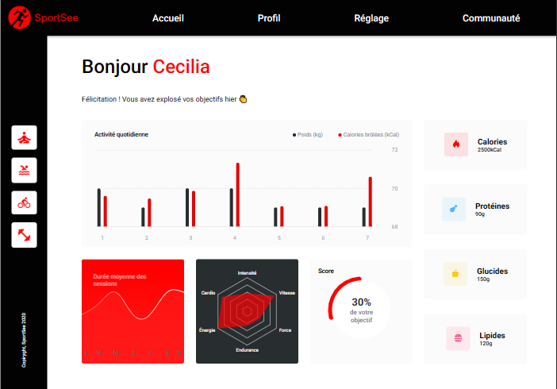

# 🏃 SportSee - Tableau de bord d'analyse sportive

## 📖 Description
Application d'analyse de progression de coaching sportif. Permet de suivre les objectifs, un résumé des sessions, un bilan des valeurs nutritionnelles et plus. 

## 🛠️ Technologies utilisées


## 🖼️ Aperçu



## 🚀 Installation

### ⚠️ Prérequis
- [Node.js](https://nodejs.org/) (v16+)
- npm ou yarn

### BackEnd (API)
Cloner et suivre les instructions d'installation du README :
https://github.com/OpenClassrooms-Student-Center/SportSee.git

### FrontEnd
```bash
git clone https://github.com/Emmie1428/SportSee-FrontEnd.git
cd sportsee
npm install
npm start
```

## 🌐 Endpoints API
GET /user/:id   --Récupère les informations du profil de l'utilisateur, sa progression et ses valeurs nutritionnelles
GET /user/:id/activity   --Récupère le poids et les calories dépensées à chaque jour
GET /user/:id/average-sessions   --Récupère la durée des activité selon le jour de la semaine
GET /user/:id/performance   --Récupère les valeurs de performances selon l'intensité, la vitesse, la force, l'endurance, l'énergie et le cardio. 

## 👥 Utilisateurs disponibles (mock)
ID: 12 NOM: Karl
ID: 18 NOM: Cécilia
